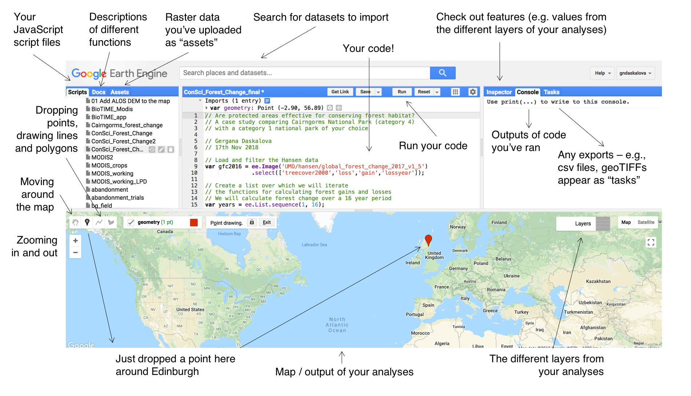

# Week ten

#### Class Tutorials
* [Intro to the Google Earth Engine](https://ourcodingclub.github.io/tutorials/earth-engine/)
* [Earth Engine website](https://earthengine.google.com/)

#### Extra Tutorials
[Intro to the Google Earth Engine and JavaScript](https://developers.google.com/earth-engine/tutorial_js_01)
[Quantifying Forest Change](https://developers.google.com/earth-engine/tutorial_forest_03)

#### Readings 
- [Gorelick, N., Hancher, M., Dixon, M., Ilyushchenko, S., Thau, D. and Moore, R.,  2017.  Google  Earth  Engine:  Planetary-scale  geospatial  analysis  for everyone. Remote Sensing of Environment, 202,   pp.18-27.](https://www.sciencedirect.com/science/article/pii/S0034425717302900)
- [Spatial data manipulation](http://rspatial.org/spatial/index.html)
- [Spatial data analysis](http://rspatial.org/analysis/index.html)

#### Isla message about challenge 4
This issue will include any information that you need to prepare for Challenge 4.

Let us know if you are not able to make it to the Thursday session next week for the full three hours, so that we can find an alternative way to assess you.
Complete the Coding Club tutorial for the big data week and for the intro to Google Earth Engine.
Required skill sets for the challenge are:
* teamwork
* use of GitHub for collaborative work
* project management with a tight deadline
* data wrangling
* data visualisation
* simple statistical analyses and interpretation (linear models, hierarchical models not required)
* professional writing and communication
* a familiarity with the interface of the google Earth Engine and the forest cover change dataset (from the Coding Club tutorial)
* no knowledge of coding in JavaScript is required

You should not need to prepare beyond doing the Coding Club tutorial for this week and any revisions from previous weeks if you were not able to complete previous tutorials on the above topics.

You should find Challenge 4 to be fun and to summarise the skill sets you have built across the course!

#### Google Earth Engine Notes

* From the Google Earth Engine, you can export .csv files of any values you’ve calculated and geoTIFF files (georeferenced images) to your Google Drive account.
* There’s different ways to answer large-scale questions on the GEE
* Examples: you can classify different land cover types, you can calculate and extract values for landscape features such as NDVI (Normalised Difference Vegetation Index) - for the world, a particular region of interest, or many different areas around the world.
* Inspector tab - click on a place in the map, and see what information is available for it.
**Other tabs shown in this picture**

#### JavaScript notes 

* Lines of code in JavaScript finish with a `;` -  note that code for e.g. defining a variable can be spread over multiple lines, but you only need to put a `;` at the end of the last line of the code chunk.
* To define new variables, you use: `var new_variable = …`
* To add comments you use `//` instead of `#`

#### Research Question
How has forest cover changed in different national parks around the world?

To do | How to do it
------|------------------
Import |  protected area(polygons)
Saved as: protected_area_tutorial | found in owners scripts tab
Use map function | to map dataset and add layer `Map.addLayer(parks);`
Inspector tab | click on a point somewhere on the map and check out the features of that point, expand feature to see location + other properties
Import dataset | `Map.addLayer(gfc);`
Set the scale for our calculations to the scale of the Hansen dataset, which is 30m | `var scale = gfc.projection().nominalScale();`

// Create a variable for the original tree cover in 2000
var treeCover = gfc.select(['treecover2000']);

// Convert the tree cover layer because the treeCover by default is in
// hundreds of hectares, but the loss and gain layers are just in hectares!
treeCover = treeCover.divide(100);

// Create a variable for forest loss
var loss = gfc.select(['loss']);

// Create a variable for forest gain
var gain = gfc.select(['gain']);

// Add the tree cover layer in light grey
Map.addLayer(treeCover.updateMask(treeCover),
    {palette: ['D0D0D0', '00FF00'], max: 100}, 'Forest Cover');

// Add the loss layer in pink
Map.addLayer(loss.updateMask(loss),
            {palette: ['#BF619D']}, 'Loss');

// Add the gain layer in yellow
Map.addLayer(gain.updateMask(gain),
            {palette: ['#CE9E5D']}, 'Gain');

#### Calculate total forest cover gain and loss in specific locations

// The units of the variables are numbers of pixels
// Here we are converting the pixels into actual area
// Dividing by 1 000 000 so that the final result is in km2
var areaCover = treeCover.multiply(ee.Image.pixelArea())
                .divide(1000000).select([0],["areacover"]);

var areaLoss = loss.gt(0).multiply(ee.Image.pixelArea()).multiply(treeCover)
              .divide(1000000).select([0],["arealoss"]);

var areaGain = gain.gt(0).multiply(ee.Image.pixelArea()).multiply(treeCover)
              .divide(1000000).select([0],["areagain"]);

#### Calculate forest loss and gain in specific areas

// Create a variable that has the polygons for just a few
// national parks and nature reserves
var parks = parks.filter(ee.Filter.or(
    ee.Filter.eq("NAME", "Yellowstone"),
    ee.Filter.eq("NAME", "Sankuru"),
    ee.Filter.eq("NAME", "Cairngorms"),
    ee.Filter.eq("NAME", "Redwood")));

// Sum the values of loss pixels.
var statsLoss = areaLoss.reduceRegions({
  reducer: ee.Reducer.sum(),
  collection: parks,
  scale: scale
});

// Sum the values of gain pixels.
var statsGain = areaGain.reduceRegions({
  reducer: ee.Reducer.sum(),
  collection: parks,
  scale: scale
});

#### Export results

Run this and then go to task tab to run each table (saves to google drive) |
`Export.table.toDrive({
  collection: statsLoss,
  description: 'NP_forest_loss'});
  
Export.table.toDrive({
  collection: statsGain,
  description: 'NP_forest_gain’});`

# Intro to javascript for earth engine

Concept | How it is done
--------|-----------------
Strings | Save a new string with the name `greetString`, `var greetString = 'Ahoy there!’;`
Numbers | variables are defined as `var`, which can also store numbers `var number = 42`, so the word ‘number’ will respond 42
Lists | Define lists with square brackets [], var listOfNumbers = [0, 1, 1, 2, 3, 5]
Objects | Make an object (or dictionary) using curly brackets {}, `var object = {foo: 'bar', baz: 13, stuff: ['this', 'that', 'the other thing’]};`
Functions | `var myFunction = function(parameter1, parameter2, parameter3) {statement; statement; statement; return statement;};
Function example` | The reflect function takes a single parameter: element. `var reflect = function(element) {return element;};`, `print('A good day to you!', reflect('Back at you!’));`
